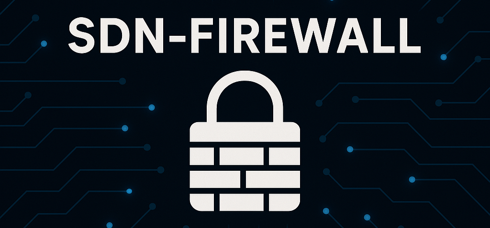

A stateless Layer 4 SDN Firewall implemented using OS-Ken and OpenFlow.

Since Ryu is no longer maintained and there are difficulties installing it with newer software, the open-source fork OS-Ken is used.

## Features
- Stateless Layer 4 packet filtering
- Automatically adds reverse paths for rules
- Manages ARP/ICMP Traffic Out-of-the-Box
- OpenFlow-based traffic control
- Easy integration with Mininet

## Installation
### 1. Clone the repository:
```sh
git clone https://github.com/DLemming/sdn-firewall.git
cd sdn-firewall
```
### 2. Install dependencies:
Install Mininet:
```sh
sudo apt-get install mininet
```

Ensure you have ```uv``` installed. If not, installations instructions can be found [here](https://docs.astral.sh/uv/getting-started/installation/#standalone-installer). Then, install all dependencies with:
```sh
uv sync
```

Alternatively, you can install dependencies using pip:
```sh
python3 -m venv .venv
source .venv/bin/activate
pip install -r requirements.txt
```

## Usage
### 1. Start the SDN-Controller

```sh
osken-manager src/Firewall.py
```

### 2. Start the Mininet Environment
```sh
sudo python3 src/OpenFlowTopo.py
```
This will initialize the Mininet topology with OpenFlow support.

### 3. Test the default Firewall Rules
Open an HTTP-Server on Host 3 in Mininet:
```sh
mininet> h3 python3 -m http.server 80 &
```

Send an HTTP-Request from Host 1 to Host 3:
```sh
mininet> h1 wget h3
```

The request will go through as the default policy in ```src/Firewall.py``` permits HTTP traffic from h1 to h3.
Sending a request from e.g. h2 to h3 will fail:

```sh
mininet> h2 wget h3  # won't work
```


## Notes
- Ensure that Open vSwitch (OVS) is installed and running.
- Run the scripts with appropriate permissions (e.g., sudo for Mininet).
- Modify the firewall rules in Firewall.py to customize filtering behavior.
- IPv6 is not supported and disabled by default.

## License
This project is open-source and available under the MIT License.
